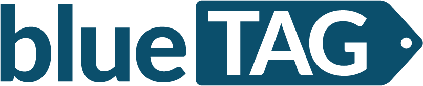

<h1 align="center">
   
  
   
   
  BlueTag
   
  
  
  
   
</h1>
<h4 align="center">An retail shop monitoring system</h4>

### Technology Stack
* ReactJS
* Redux
* Grommet

### Installation
1. Clone this repository.
2. Install all the dependencies by running `yarn install`.
3. Start the [API server](https://github.com/rrsilaya/bluetag-server) at port 3001.
4. Run the web app using `yarn start`.

### Credentials
If you used the seed data from the API server, you can use the following credentials to login.

|   Username  |  Password  | Account Type |
|-------------|------------|--------------|
| admin       | admin      | manager      |
| jboshell0   | yNtHHdk6Cd | employee     |
| ggiamuzzo1  | kcSbdkMC   | manager      |
| rgwatkin2   | apOTOOdQ   | manager      |
| ghares3     | mql8QX     | employee     |
| swallbrook4 | z4XOs77wn  | employee     |

### Developers
* Afable, Lorenz Matthew
* Roxas, Harold James
* Silaya, Ralph Lawrence
